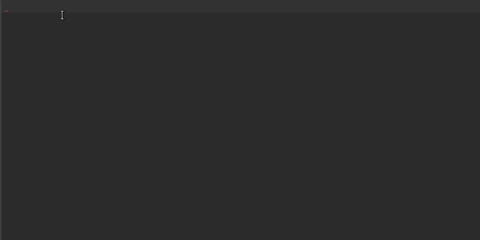
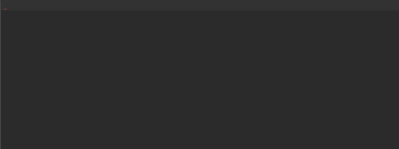
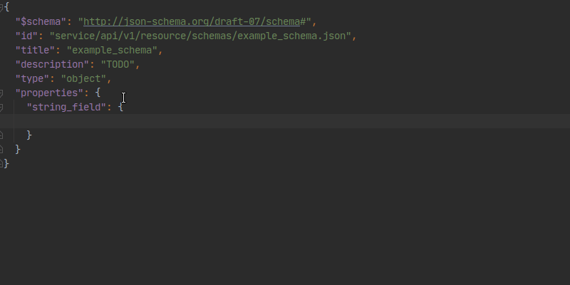
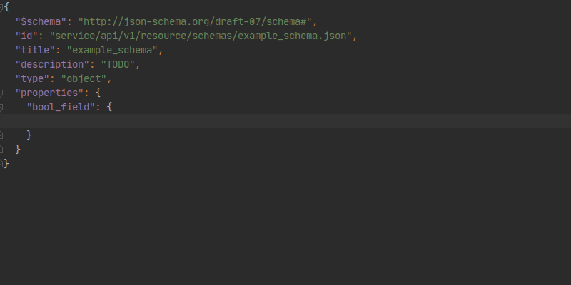
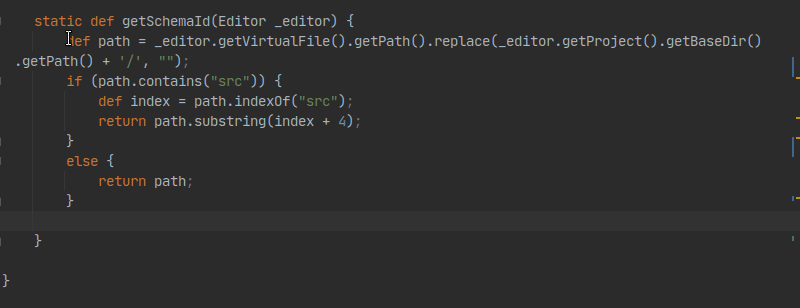

# JetBrains [Live Templates](https://www.jetbrains.com/help/phpstorm/using-live-templates.html)
Templates:
* json-schema4json.xml (json files)
* json-schema4yaml.xml (yaml files)

Copy templates to JetBrains IDE configuration directory:    
**Linux** `/home/<username>/.config/JetBrains/<IDE name>/templates/*`   
**MacOS** `/Users/<username>/Library/Preferences/<IDE name>/templates/*`   
**Windows** `???`   

## Template commands   
### Schema file
#### 1ObjectSchema

<details>
  <summary>Template body <sup>click to expand</sup></summary>
    
```
{
  "$schema": "http://json-schema.org/draft-$draft$/schema#",
  "id": "$schema_id$",
  "title": "$title$",
  "description": "$description$",
  "type": "object",
  "properties": {
    "$_1$": {
      $END$
    }
  },
  "required": [
    "$_1$"
  ]
}
```
</details>

#### 1ArraySchema

<details>
  <summary>Template body <sup>click to expand</sup></summary>
    
```
{
  "$schema": "http://json-schema.org/draft-$draft$/schema#",
  "id": "$schema_id$",
  "title": "$title$",
  "description": "$description$",
  "type": "array",
  "minItems": $minItems$,
  "maxItems": $maxItems$,
  "uniqueItems": $uniqueItems$,
  "items": {
    $END$
  }
}
```
</details>

### Schema properties
#### 1Object

<details>
  <summary>Template body <sup>click to expand</sup></summary>
    
```
"type": "object",
"description": "$description$",
"properties": {
  "$_1$": {
    $END$
  }
},
"required": [
  "$_1$"
]
```
</details>

#### 1Array

<details>
  <summary>Template body <sup>click to expand</sup></summary>
    
```
"type": "array",
"description": "$description$",
"minItems": $minItems$,
"maxItems": $maxItems$,
"uniqueItems": $uniqueItems$,
"items": {
  $END$
}
```
</details>

#### 1Integer

<details>
  <summary>Template body <sup>click to expand</sup></summary>
    
```
"type": "integer",
"description": "$description$",
"minimum": $minimum$,
"maximum": $maximum$,
"multipleOf": $multipleOf$,
"default": $default$
```
</details>

#### 1Number

<details>
  <summary>Template body <sup>click to expand</sup></summary>
    
```
"type": "number",
"description": "$description$",
"minimum": $minimum$,
"maximum": $maximum$,
"multipleOf": $multipleOf$,
"default": $default$
```
</details>

#### 1String

<details>
  <summary>Template body <sup>click to expand</sup></summary>
    
```
"type": "string",
"description": "$description$",
"minLength": $minLength$,
"maxLength": $maxLength$,
"pattern": "$pattern$"
```
</details>

#### 1Boolean

<details>
  <summary>Template body <sup>click to expand</sup></summary>
    
```
"type": "boolean",
"description": "$description$",
"default": $default$
```
</details>

### Schema formats
#### 1utcMillisecFormat
```
"type": "number",
"format": "utc-millisec",
"description": "$description$"
```

#### 1uuidFormat 
```
"type": "string",
"format": "uuid",
"description": "$description$"
```

## Helper template
If you need to write groovyScripts yourself, the following template may come in handy.   
The code below escapes the **copied** groovyScript for later use in template variables.
```
groovyScript("def str = _1.replace(\"\\n\", \"\"); while (str.contains(\"  \")) { str = str.replace(\"  \", \" \"); }; str = str.replace(\"\\\"\", \"\\\\\\\"\"); return \"groovyScript(\\\"\"+str+\"\\\")\"", clipboard())
```


